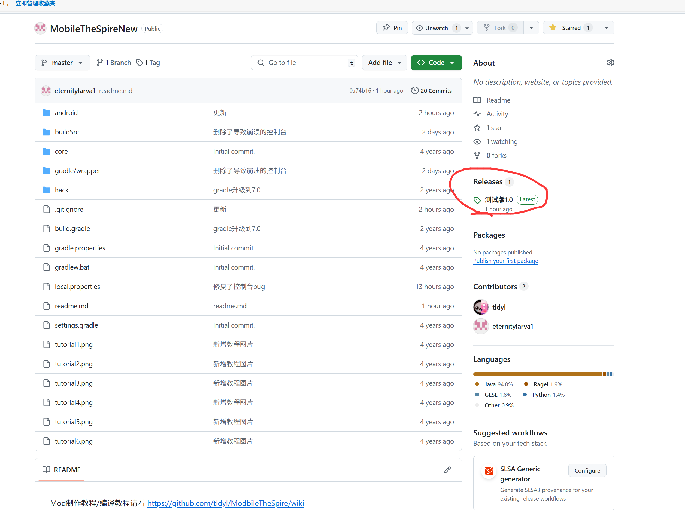
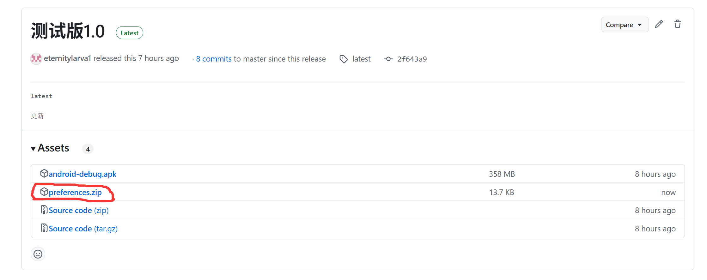
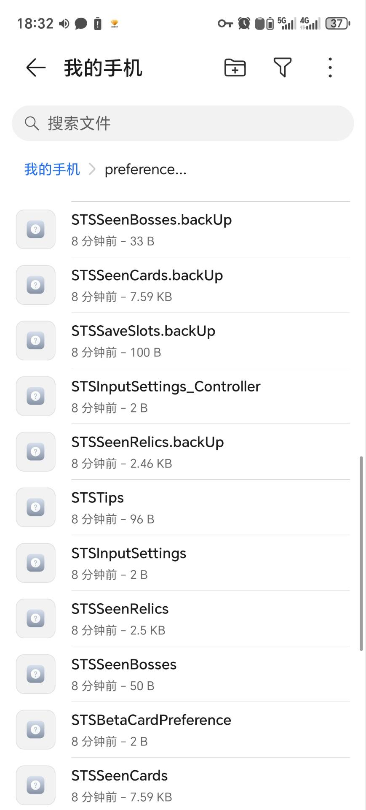
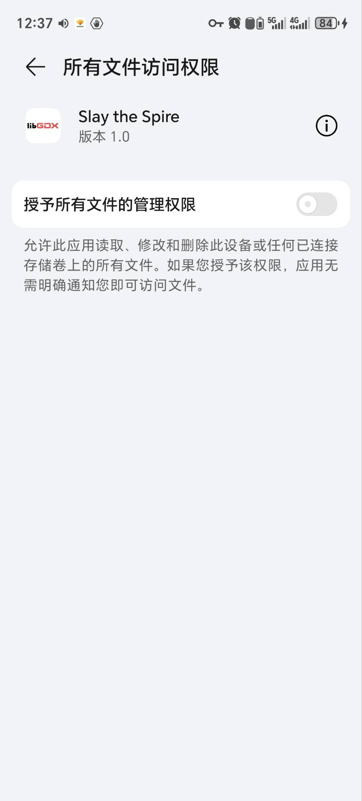
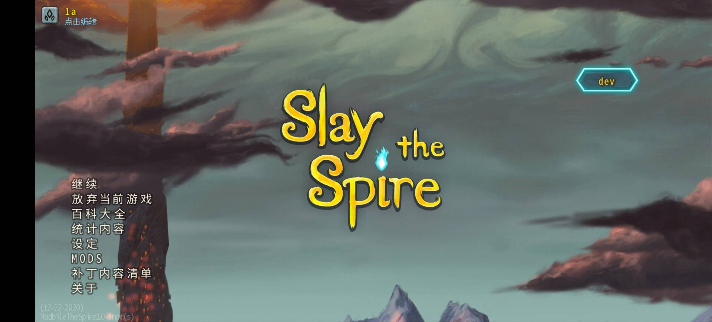
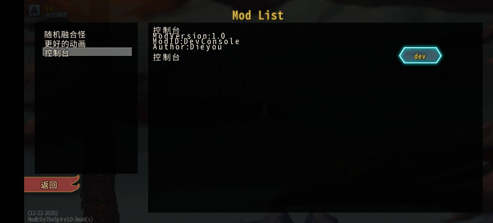
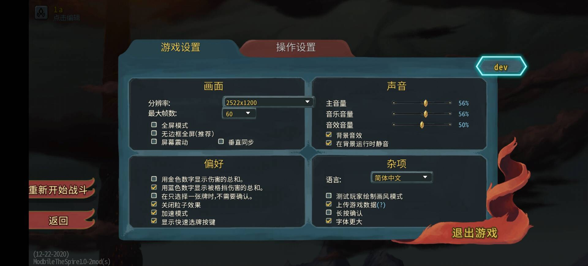
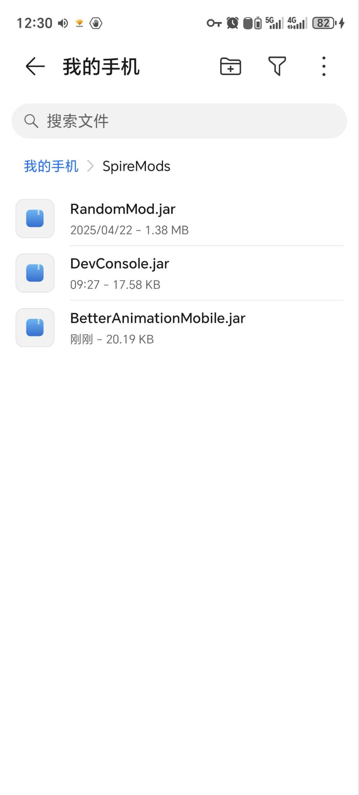

# p.s.此版本仅供交流学习使用，如有条件请支持正版
https://store.steampowered.com/app/646570/Slay_the_Spire/

https://play.google.com/store/apps/details?id=com.humble.SlayTheSpire&hl=zh

## Mod制作教程/编译教程请看
https://github.com/tldyl/ModbileTheSpire/wiki

注意！！！电脑版mod和这个版本的mod并不通用！，请勿直接把电脑版mod放到这个版本

细节可以参考我写的几个mod

我写的mod:(可以在这个版本使用，可以在对应的github界面下载使用)

控制台mod(手机版):
https://github.com/eternitylarva1/Devconsle

快速slmod(手机版):
https://github.com/eternitylarva1/QuickRestartMobile

随机融合怪（手机版）：
https://github.com/eternitylarva1/randomMonsterMoblie

全解锁mod(手机版):
https://github.com/eternitylarva1/UnlockAll

更好的动画（手机版）：
https://github.com/eternitylarva1/BetterAnimationMobile

## 使用教程

1.下载和安装

如图所示，点击下载，然后点击安装，安装完成之后，就可以打开

2.第一次打开前，建议先导入存档，能避免反复重开（这一步可以跳过，但是可能会比较麻烦）

导入存档教程：

1.下载这个

2.解压后，将其内容放到根目录下的同名文件夹中即可

3.打开之后

第一次打开会弹出一个权限窗口，获取对应权限之后,返回到游戏界面

这期间游戏可能会出现闪屏之类的问题,请打开音量,听到游戏背景音乐出现的时候

可以返回主页（不要杀掉后台）然后重新进游戏即可解决

如果在黑屏期间发生了闪退，注意一定要杀掉后台再重新进游戏，不然会一直闪退！

3.页面展示

（注：右边那个dev按钮是控制台mod提供的,没装这个mod的话不会有这个按钮，快速重开按钮同理）

4.Mod安装位置：

5.报错位置

根目录下的SpireCrashLog.txt

如果出现闪退等报错,可以将这个发我或提交issues